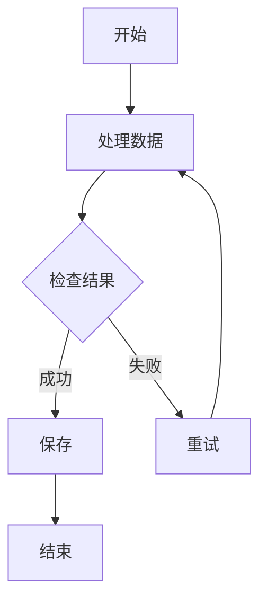
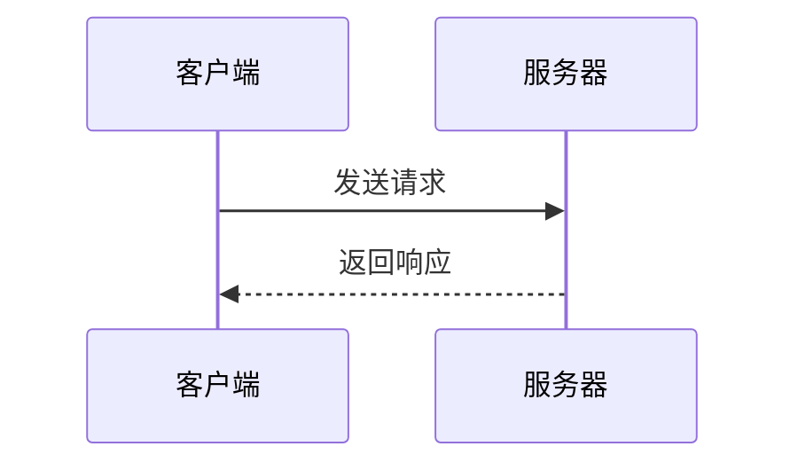
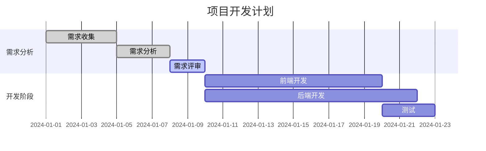

# Mermaid Render MCP

一个用于渲染 Mermaid 图表的HTTP服务器。支持输入 Mermaid 代码，输出 PNG 或 SVG 图像。

## 功能特性

- 🎨 支持 Mermaid 图表渲染（流程图、序列图、甘特图等）
- 🖼️ 输出 PNG 和 SVG 格式
- 📏 可自定义图像尺寸
- 🌐 HTTP REST API 接口

## 快速开始

### Docker 部署 (推荐)

```bash
# 构建并启动
docker-compose up --build

# 后台运行
docker-compose up -d --build
```

### 本地运行

```bash
# 安装依赖
npm install

# 启动服务器
node png-server.js
```

## API 接口

### 健康检查

```http
GET /health
```

### 渲染为 Base64

```http
POST /render
Content-Type: application/json

{
  "code": "graph TD\n    A[开始] --> B[结束]",
  "width": 800,
  "height": 600,
  "format": "png"
}
```

**参数：**

- `code` (string, 必需): Mermaid 图表代码
- `width` (number, 可选): 图像宽度，默认 800px
- `height` (number, 可选): 图像高度，默认 600px
- `format` (string, 可选): 输出格式 "png" 或 "svg"，默认 "png"

### 渲染为文件

```http
POST /render/image
Content-Type: application/json

{
  "code": "graph TD\n    A[开始] --> B[结束]",
  "format": "png"
}
```

## 测试

```bash
# 甘特图渲染测试
node test-gantt.js

# 快速测试
node test-gantt.js --quick
```

## 使用示例

### 流程图



### 序列图



### 甘特图



## 测试使用

1. **启动服务器**
   ```bash
   node png-server.js
   ```

2. **运行测试**
   ```bash
   # 完整测试
   node test-gantt.js
   
   # 快速测试
   node test-gantt.js --quick
   ```

3. **查看结果**
   - 测试文件保存在 `test-output/` 目录
   - 包含 PNG、SVG 和 Base64 格式输出

## 技术栈

- **Node.js** - 运行时环境
- **Express.js** - HTTP 服务器
- **Puppeteer** - 浏览器自动化和图像渲染
- **Mermaid** - 图表渲染引擎
