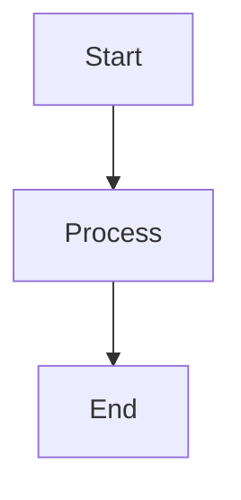
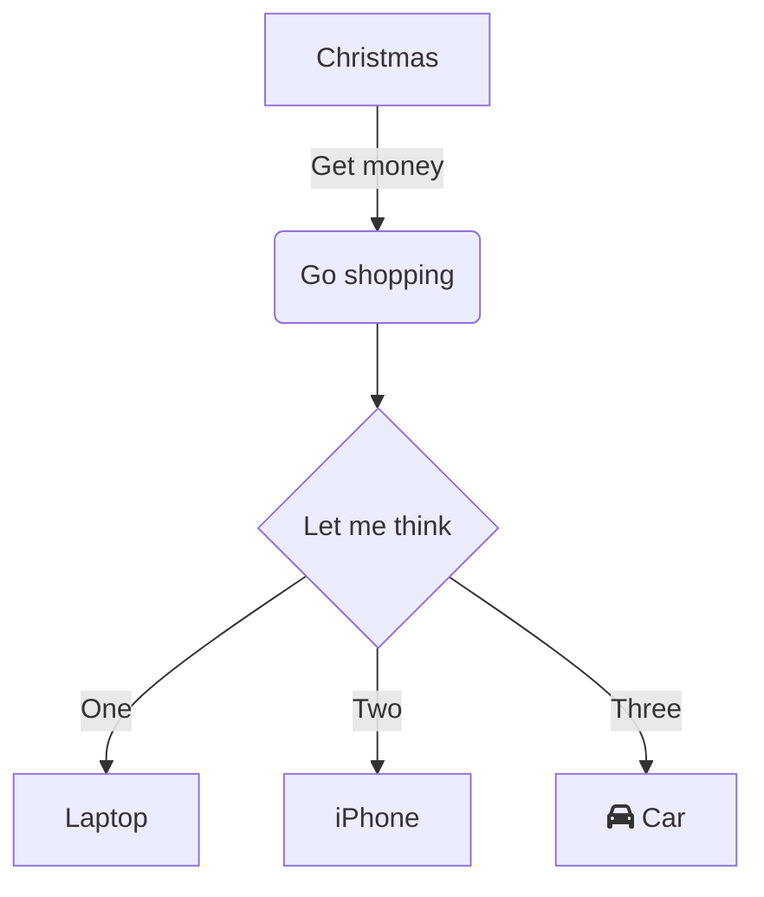
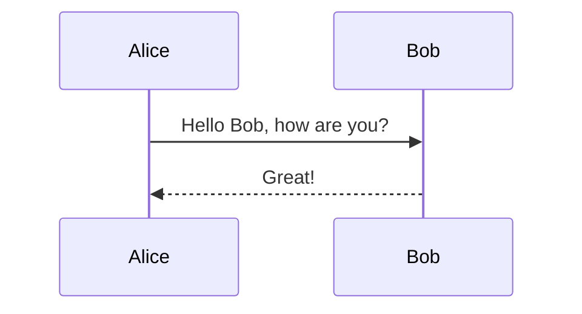
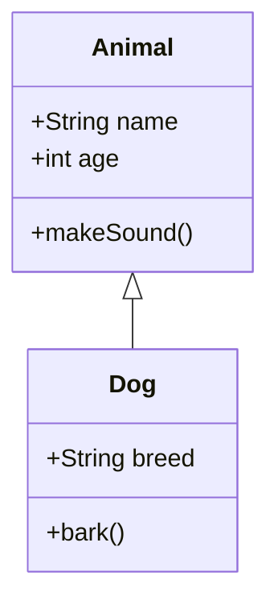

# Mermaid Render MCP Server

A Model Context Protocol (MCP) server that provides Mermaid diagram rendering capabilities using the mermaid.ink service.

## Features

- **render_mermaid**: Render Mermaid diagrams to PNG or SVG format
- **encode_mermaid**: Encode Mermaid code to mermaid.ink compatible format
- **decode_mermaid**: Decode encoded strings back to Mermaid code

## Quick Start

### Using Docker Compose

```bash
docker-compose up -d
```

### Local Development

```bash
npm install
npm start
```

### Testing and Image Download

```bash
npm test
```

The test client will download and save rendered diagrams to the `./output` directory in both PNG and SVG formats.

## Tools

### 1. render_mermaid

Renders a Mermaid diagram using mermaid.ink service.

**Parameters:**

- `mermaid_code` (string, required): The Mermaid diagram code
- `format` (string, optional): Output format ("png" or "svg", default: "png")

**Example:**



### 2. encode_mermaid

Encodes Mermaid code to the compressed format used by mermaid.ink.

**Parameters:**

- `mermaid_code` (string, required): The Mermaid diagram code to encode

### 3. decode_mermaid

Decodes an encoded string back to readable Mermaid code.

**Parameters:**

- `encoded_string` (string, required): The encoded string (with or without "pako:" prefix)

## Usage Examples

### Basic Flowchart



### Sequence Diagram



### Class Diagram



## Docker Deployment

The service is containerized and can be deployed using Docker Compose:

```bash
# Start the service
docker-compose up -d

# View logs
docker-compose logs -f

# Stop the service
docker-compose down
```

## Environment Variables

- `NODE_ENV`: Set to "production" for production deployment

## Health Check

The service includes a health check endpoint that verifies the server is running properly.

## License

MIT
